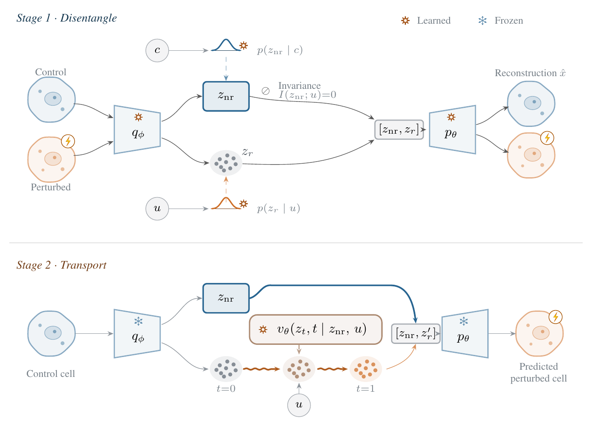

# DRIFT: Disentangled Responsive-Invariant Flow Transport



Single-cell perturbation prediction in two stages:

1. **A disentangled autoencoder** encodes each cell into an invariant block `z_nr`, with prior
   `p(z_nr | c)` on the covariates, and a responsive block `z_r`, with prior `p(z_r | u)` on the
   perturbation.
2. **A conditional flow** transports `z_r` from a control cell to the perturbed state, keeping the
   cell's `z_nr`.

## Install

```bash
pip install -r requirements.txt
```

## Data

Download the [Norman and Replogle](https://drive.google.com/drive/folders/1Q7xNeuqIp3nrMlsWnXX0c0SU90cnv9YQ)
and [ComboSciPlex](https://figshare.com/articles/dataset/combosciplex/25062230?file=44229635)
datasets into `data/`, and the
[perturbation features](https://drive.google.com/drive/folders/1FSq5HIReZP42N2BseI8FKcCbrTdaSbhB)
into `resources/`.

## Usage

```bash
python scripts/train_vae.py --run-name additive-s0-vae --dataset additive --seed 0
python scripts/train_flow.py --run-name additive-s0 --seed 0 --vae-ckpt checkpoints/additive-s0-vae/last.ckpt
python scripts/evaluate.py checkpoints/additive-s0/last.ckpt --json results/additive-s0.json
```

`--dataset` is one of `additive`, `holdout`, `replogle`, `combosciplex`. The defaults in
`drift/config.py` are the published settings. To run the five seeds of the paper:

```bash
./reproduce.sh additive 0,1,2,3,4 0      # dataset, seeds, GPU
```

## Citation

Pending.

## License

MIT
